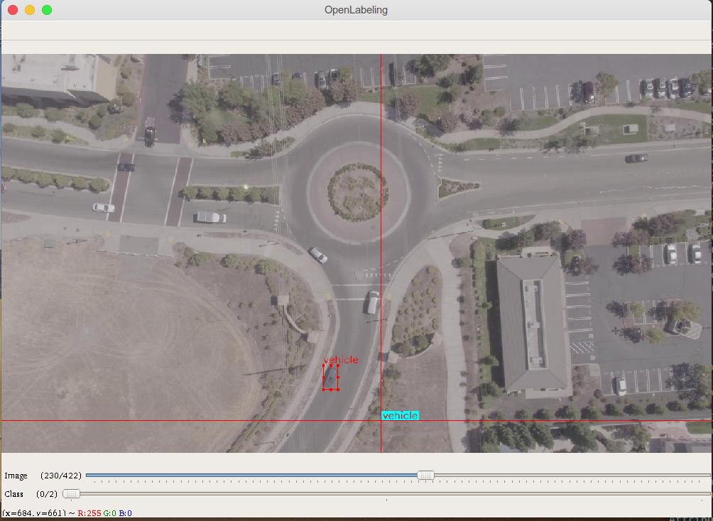

# OpenLabeling++


Improved version of [OpenLabeling](https://github.com/Cartucho/OpenLabeling). Its two main contributions are:
- The integration of the state-of-the-art real-time class-agnostic object tracker [SiamMask](https://github.com/foolwood/SiamMask), which handles particularly well severe changes in appearance and bounding box aspect ratio.
- Enables to skip the tracking loop by pressing the key `P` (or the spacebar).

Those two features combined enable a significant time-saving in the tedious process of  labeling sequences.

Works both on CPU (3-5fps) and GPU (20-30fps).

## Setup

- To install all the dependencies, simply type:

```
pip install -r requirements.txt
```


- Download the SiamMask pretrained weights:

```
cd siamMask/pretrained
wget -q http://www.robots.ox.ac.uk/~qwang/SiamMask_VOT.pth
wget -q http://www.robots.ox.ac.uk/~qwang/SiamMask_DAVIS.pth
```

- Run OpenLabeling's GUI (from the root folder):

```
python -m main.main
```

By default, SiamMask will be used. To use another tracker, provide it as command line argument, like so:
```
python -m main.main --tracker_type KCF
```


*Manually provided bounding box of a vehicle at frame 0.*


*Bounding box of the tracked vehicle after 230 frames. Notice how SiamMask has automatically modified the aspect ratio of the vehicle after it turned.*
